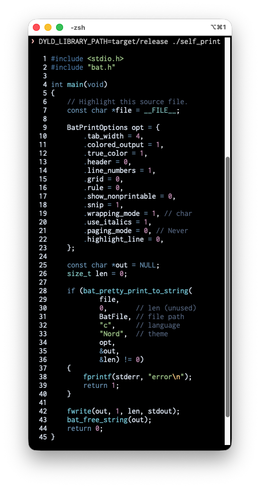

# bat-c

[](https://github.com/kojix2/bat-c/actions/workflows/test.yml)
[](https://tokei.kojix2.net/github/kojix2/bat-c)

Provides a C API for [bat](https://github.com/sharkdp/bat), enabling its use from various programming languages via FFI.



## Installation

Download binaries from [GitHub Releases](https://github.com/kojix2/bat-c/releases).

From source code:

```sh
git clone https://github.com/kojix2/bat-c
cd bat-c
cargo build --release
# target/release/libbat_c.so (Linux), libbat_c.dylib (macOS), bat_c.dll (Windows)
```

**Note for macOS users:**  
The library is built with `rpath = true`, so the `.dylib` uses `@rpath` for loading. If you extract the release archive and use it directly from that directory, it should work without additional setup. If you install the library to a system directory (e.g., `/usr/local/lib`), ensure the directory is in your `@rpath` or set `DYLD_LIBRARY_PATH` accordingly.

## API Reference

See [`bat.h`](bat.h) for detailed documentation including:
- Parameter requirements for each `BatInputType`
- Valid values for `wrapping_mode` (0=NoWrapping, 1=Character) and `paging_mode` (0=Never, 1=Always, 2=QuitIfOneScreen)
- Memory safety requirements and proper usage of `bat_free_string`
- Error handling (functions return 0 on success, 1 on error; error details are printed to stderr)

### C API Overview

```c
/**
 * BatInputType enum to specify the type of input
 */
typedef enum BatInputType {
  BatBytes,
  BatFile,
  BatFiles,
} BatInputType;

/**
 * Struct to hold print options
 */
typedef struct BatPrintOptions {
  size_t tab_width;
  bool colored_output;
  bool true_color;
  bool header;
  bool line_numbers;
  bool grid;
  bool rule;
  bool show_nonprintable;
  bool snip;
  size_t wrapping_mode;
  bool use_italics;
  size_t paging_mode;
  size_t highlight_line;
} BatPrintOptions;

/**
 * Print with specified options.
 * Returns 0 on success, 1 on error.
 */
int32_t bat_pretty_print(const char *input,
                         size_t length,
                         enum BatInputType input_type,
                         const char *language,
                         const char *theme,
                         struct BatPrintOptions options);

/**
 * Pretty print output to a string.
 * Returns 0 on success, 1 on error.
 */
int32_t bat_pretty_print_to_string(const char *input,
                                   size_t length,
                                   enum BatInputType input_type,
                                   const char *language,
                                   const char *theme,
                                   struct BatPrintOptions options,
                                   const char **output,
                                   size_t *output_length);

/**
 * Free the string allocated by `bat_pretty_print_to_string`.
 */
void bat_free_string(const char *s);

/**
 * Return the version of the library
 */
const char *bat_c_version(void);
```

### Usage Example

```c
#include <stdio.h>
#include <string.h>
#include "../bat.h"

int main()
{
    const char *text = "<span style=\"color: #ff00cc\">Hello world!</span>\n";
    const char *language = "html";
    const char *theme = "Nord";

    BatPrintOptions options = {
        .tab_width = 4,
        .colored_output = 1,
        .true_color = 1,
        .header = 1,
        .line_numbers = 1,
        .grid = 1,
        .rule = 1,
        .show_nonprintable = 0,
        .snip = 1,
        .wrapping_mode = 1,
        .use_italics = 1,
        .paging_mode = 0,
        .highlight_line = 0};

    // Test with bytes input
    bat_pretty_print(
        text,
        strlen(text),
        BatBytes,
        language,
        theme,
        options);

    // Test with file input
    const char *file_path = "test_input.html";
    bat_pretty_print(
        file_path,
        0,
        BatFile,
        language,
        theme,
        options);

    // Test with multiple files input
    const char *file_paths[] = {"test_input1.html", "test_input2.html"};
    bat_pretty_print(
        (const char *)file_paths,
        2,
        BatFiles,
        language,
        theme,
        options);

    return 0;
}
```

## Multi-Language Examples

Examples demonstrating how to use bat-c from various programming languages via FFI:

- **[C](examples/C/)** - Direct usage with Makefile
- **[Python](examples/Python/)** - Using ctypes
- **[Go](examples/Go/)** - Using cgo with dynamic/static linking
- **[Ruby](examples/Ruby/)** - Using ffi gem
- **[Julia](examples/Julia/)** - Using ccall
- **[D](examples/D/)** - Using extern(C) with dmd/ldc2
- **[Zig](examples/Zig/)** - Using @cImport with build.zig
- **[Nim](examples/Nim/)** - Using importc pragma
- **[V](examples/V/)** - Using V's C interop
- **[TypeScript/Node.js](examples/TypeScript/)** - Using Node-API (N-API)

Each example directory contains:
- `basic` - Simple example highlighting HTML code
- `self_print` - Example that syntax-highlights its own source file
- `README.md` - Build and run instructions specific to that language

All examples require building the Rust library first:
```sh
cargo build --release
```

## Development

### Running Tests

To run tests written in Rust:

```sh
cargo test
```

To run tests in C:

```sh
cd test && ./test.sh
```

### Creating Header Files

```sh
cargo install --force cbindgen
cbindgen --config cbindgen.toml --crate bat-c --output bat.h
```

## License

MIT
